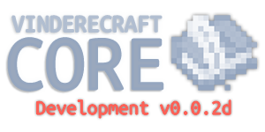

### Foundation for Minecraft: Java Edition Servers running Paper
**-- WARNING** Keep in mind, this is a DEVELOPMENT BUILD which means it may be unstable. Heck, it may not even load properly. No guarantees!

**-- INFO** VindereCraft Core was developed to act as the primary plugin for all other VindereCraft plugins to piggyback off of via API. It also handles most basic or administrative tasks, with functions like chat formatting or permissions being handled by a separate plugin.
Core contains the functions to connect to databases and generate config files for the rest of the plugin suite to also access.

## Planned Features
- MySQL, MongoDB, and SQLite database integration for player data storage. (See [Issue #6](https://github.com/VindereCraft/VindereCraft-Core/issues/6), [Issue #2](https://github.com/VindereCraft/VindereCraft-Core/issues/2), [Issue #3](https://github.com/VindereCraft/VindereCraft-Core/issues/3))
- `/version` command to view version of Core as well as other VindereCraft Studio plugins. (See [Issue #5](https://github.com/VindereCraft/VindereCraft-Core/issues/5))
- `/player` command to view information about a specific player, like their IP address and locale.  Features will be primarily suited for server administration. (See [Issue #4](https://github.com/VindereCraft/VindereCraft-Core/issues/4))